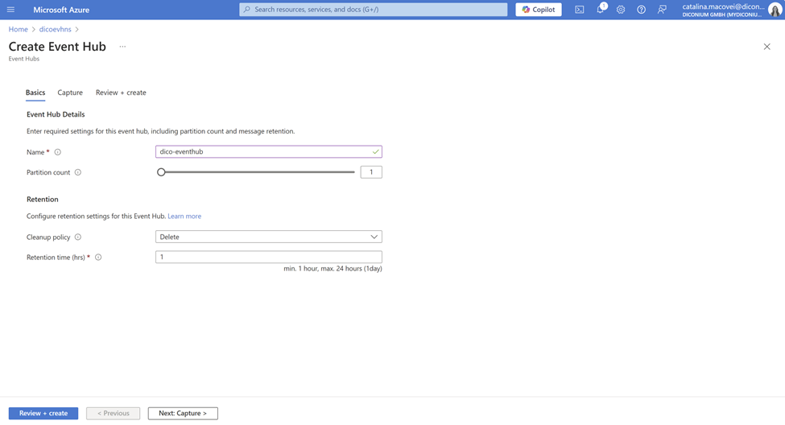
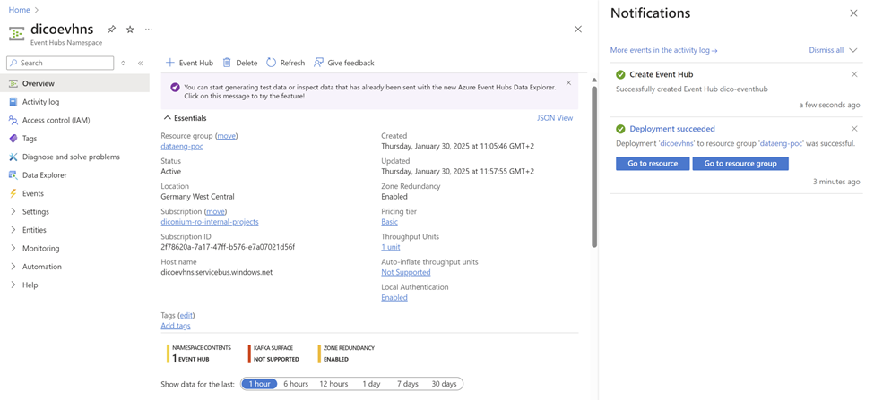
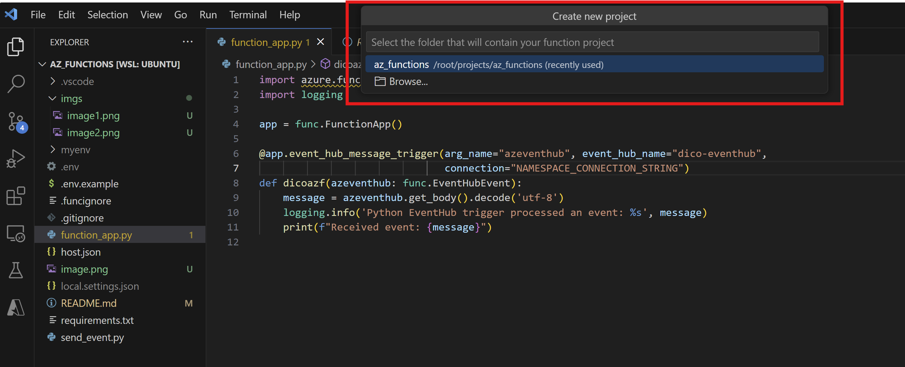
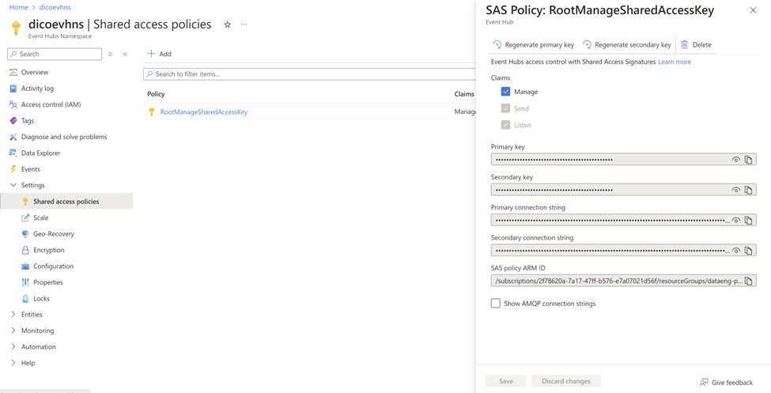
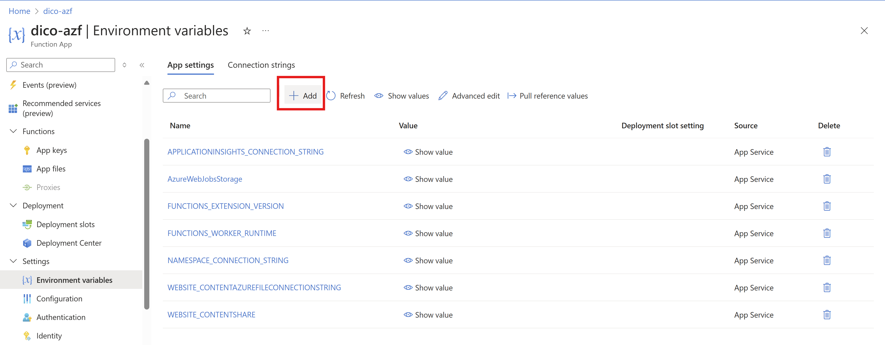
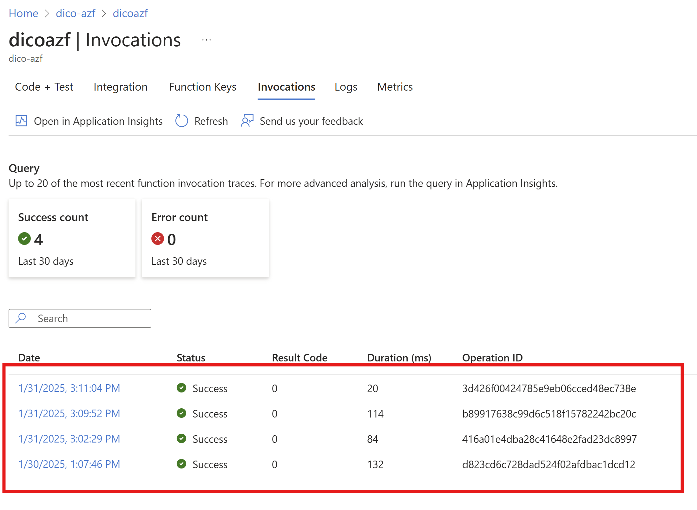

# Azure EventHub forwarder
This is a python-based app that sends messages to Azure Event Hub and forwards them to a Kafka server using an Azure Function.

## Demo

### 1. Evironment setup:
 - Install VSCode if you don't have it already  
- Setup ubuntu WSL following [this link](https://learn.microsoft.com/en-us/windows/wsl/tutorials/wsl-vscode)  
- Install python extension  
- Install Azure Functions extension
- Create a python venv by these steps:
- Navigate to the directory where you want to create your venv:
  ```python -m venv myenv```
- Activate it:
  ```source myenv/bin/activate```
- Install python packages within same venv:
    ```pip install azure-eventhub```
    ```pip install azure-identity```
    ```pip install aiohttp```

### 2. Create an Event Hub from Azure portal
- Create the Namespace
    - Select the subscription in which you want to create the namespace.
    - Select the resource group you created in the previous step.
    - Enter a name for the namespace. The system immediately checks to see if the name is available.
    - Select a location for the namespace. I chose Germany West.
    - Choose Basic for the pricing tier. 
    - Leave the throughput units settings as it is. 
    - Select ```Review + Create``` at the bottom of the page.
    - For a much detailed demo, you can use [Microsoft Documentation](https://learn.microsoft.com/en-us/azure/event-hubs/event-hubs-create)

- Create the main EventHub:
    - On the Overview page of the deployed Namespace, select ```+ Event hub``` on the command bar.
    - Type a name for your event hub, rest of settings leave as default, then select ```Review + create```.
      

- The end of this step should look like this:
  

### 3. Create the function app
- Navigate to VSCode and press F1 to browse for Azure actions in Command Palette, choose ```Azure Functions: Create New Project```. 
- Choose the set up project folder, mine is ```az_functions```
  
- Next, you will have many prompts regarding:
    - Language: python 
    - Function app version model: V2
    - Template: EventHub trigger.
      This will allow the function to be triggered when a message is received from an Event Hub.
    - Select Function Name
    - Select Storage Account. You still can create a new one here, if you need.
    - Select python version.
    - In function generated app, you need to set the parameters.
      ```
      arg_name="azeventhub"
      event_hub_name="your-eventhub-name"
      connection="NAMESPACE_CONNECTION_STRING"
      ```
    - You can print some log info in order to test the function later.
    - You should deploy the function using  VSCode Command Palette. 
    - Next, you have to setup ```NAMESPACE_CONNECTION_STRING``` evironment variable in the newly created resource of your function app from Azure portal.
      - This string you will take from ```EventHub Namespace > Settings > Shared Access Policies```. From window open to the left, copy ```Primary Connection String```. It looks like this:
      
      - In your ```function resource > Settings > Evironment variables > Add``` create the new environment variable and paste the connection string you copied earlier.
      
      - Deploy the function again.

### 4. Create a python event sender
Next, we will create a python event sender script: ```send_event.py```. You can copy paste the code from my script but make sure o create a local ```.env``` in the root of the project following ```.env.example``` file structure.  
  - Setup these ```.env``` variables
    ```
    CONNECTION_STRING=
    EVENT_HUB_NAME=
    ```
  - Then, run the script in your terminal with activated venv:
    ```python send_event.py``` 

### 5. Check function invocation 
Check function invocation from Azure portal, by navigating to ```function resource > Invocations```:


## Author
Catalina Macovei


    

